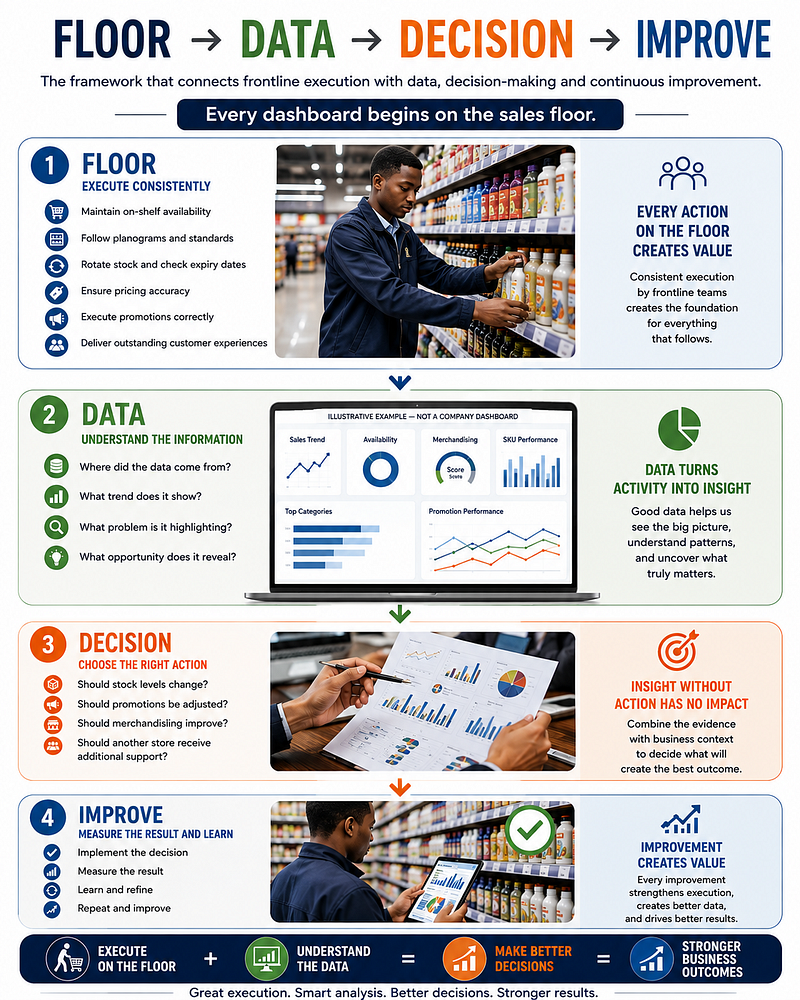

# Every Dashboard Begins on the Sales Floor


## From FMCG Retail Operations to Data Analytics and Better Business Decisions

I spent five years working in FMCG retail before formally transitioning into data analytics.

During that time, I worked with products, shelves, customers, merchandising standards, availability, promotions and store execution.

Over time, the way I interpreted that work changed.

I stopped seeing retail execution as a collection of separate tasks.

I started seeing it as a system.

Every activity created information.

A product was available or unavailable.

A shelf followed the required planogram or did not.

A promotion was executed correctly or missed.

A product had the required visibility or did not.

Those activities eventually became reports, metrics, dashboards and business decisions.

That experience shaped how I now approach data.

> ## A dashboard can identify a problem. Understanding the operation behind the data helps explain why it happened.

---

# Explore This Repository

| Section                        | What You'll Find                                                               |
| ------------------------------ | ------------------------------------------------------------------------------ |
| 📖 [The Story](./article/)     | The journey from FMCG retail operations to data analytics                      |
| 📊 [Case Study](./case-study/) | A practical example of investigation, business context and root-cause analysis |
| 🧠 [Framework](./framework/)   | The FLOOR → DATA → DECISION → IMPROVE analytical framework                     |
| 🖼️ [Images](./images/)        | Visual assets supporting the project                                           |

---

# The Core Framework

My approach to understanding business performance can be summarised in four stages:

# FLOOR → DATA → DECISION → IMPROVE



This framework represents the connection between frontline execution and business decision-making.

## 1. FLOOR

### Execution happens.

Products are stocked.

Shelves are maintained.

Promotions are implemented.

Customers interact with products.

Operational decisions are made.

**This is where the data begins.**

---

## 2. DATA

### Capture what happened.

Operational activity becomes measurable information through reports, forms, systems and performance metrics.

This is where questions begin to emerge:

* What happened?
* Where did it happen?
* How often did it happen?
* Is there a pattern?

---

## 3. DECISION

### Combine evidence with business context.

A number can identify an exception.

But the underlying cause may require further investigation.

The goal is not only to report what happened.

The goal is to understand:

> **Why did it happen?**

---

## 4. IMPROVE

### Take action.

Measure the result.

Learn from what changed.

Then repeat the process.

```text
FLOOR
   ↓
DATA
   ↓
DECISION
   ↓
IMPROVE
   ↓
REPEAT
```

---

# Practical Case Study

## When the Report and the Shelf Told Different Stories

One experience shaped how I think about data quality, investigation and business context.

### The Business Situation

A merchandising report showed that a product was unavailable.

### The Initial Signal

```text
Reported Status: Product Unavailable
```

The initial interpretation suggested a possible:

* Stock availability issue
* Replenishment issue
* Inventory issue

However, the physical shelf told a different story.

### The Investigation

When I checked the shelf, the product was physically present.

The investigation therefore moved beyond the original assumption.

I checked the product placement against the required planogram.

### The Root Cause

The product was available.

However, it had been positioned incorrectly relative to the required planogram.

```text
Reported Problem
       ↓
Product Unavailable
       ↓
Investigation
       ↓
Product Found on Shelf
       ↓
Further Investigation
       ↓
Incorrect Product Placement
       ↓
Root Cause Identified
```

### The Action

The product placement was corrected and the surrounding shelf was checked against the required merchandising standard.

### The Key Lesson

> **The report identified the signal.**
>
> **The sales floor provided the context needed to investigate the cause.**

This experience reinforced an important analytical principle:

> **Do not stop at what the data says. Investigate how the result was produced.**

[Explore the full case study →](./case-study/)

---

# Retail Experience and Analytical Thinking

My experience in FMCG retail has involved:

* On-shelf availability
* SKU management
* Merchandising execution
* Planogram compliance
* Promotional execution
* Product visibility
* Customer interaction
* Store-level reporting
* Operational problem-solving

These experiences developed the same type of questions I now use when approaching data:

### What happened?

### Why did it happen?

### Where did it happen?

### What evidence supports the explanation?

### What action should follow?

### What changed after the action?

---

# Retail Performance Snapshot

The following figures provide context for my experience:

| Metric              | Context                                        |
| ------------------- | ---------------------------------------------- |
| **285+**            | SKUs worked across                             |
| **98%**             | Latest measured on-shelf availability          |
| **88%**             | Latest merchandising scorecard                 |
| **R10.3M → R16.0M** | Team YTD sales performance from 2024 to 2025   |
| **~55%**            | Approximate increase in team sales performance |

> **Note:** The R16.0 million figure represents team sales performance and is not presented as my individual sales contribution.

The numbers represent outcomes.

The daily execution provides the operational context behind those outcomes.

---

# From Retail Operations to Data Analytics

While working full-time in FMCG retail, I began developing analytical skills in:

* Excel
* SQL
* Power BI
* Python
* Data cleaning
* Data visualisation
* Dashboard development

The tools gave me new ways to investigate questions I had already encountered on the sales floor.

## Example Analytical Project

One of my projects involved analysing an admissions dataset containing **7,543 records** covering **2023 to 2025**.

During the analysis:

* **2,543 duplicate records** were identified.
* The dataset was reduced to **5,000 records** after cleaning.
* The analysis examined admission outcomes, missing transcripts, geographic differences and follow-up activity.
* Excel and Looker Studio were used to clean, analyse and communicate findings.

The project reinforced a lesson I had already learned in retail:

> **Before acting on a number, understand how the number was produced.**

Data cleaning changed the dataset.

Segmentation changed the questions.

Visualisation made patterns easier to communicate.

But the most important part of the process was learning to ask better questions.

---

# Why Retail Experience Matters in Analytics

Data does not exist independently from the operation that creates it.

A dashboard may show:

* A decline in availability
* A change in sales
* Poor promotional performance
* An unusual regional pattern
* A potential data quality issue

The dashboard can identify the signal.

Understanding the business environment can help determine which questions should come next.

My experience gives me two connected perspectives:

## Operational Perspective

Understanding what happens on the ground.

## Analytical Perspective

Using data to investigate, communicate and support decisions.

Together:

```text
Retail Experience
        +
Analytical Skills
        ↓
Business Understanding
        ↓
Better Questions
        ↓
Better Decisions
```

---

# Repository Purpose

This repository documents the thinking behind my transition from FMCG retail operations into data analytics.

It is designed as a portfolio project demonstrating how frontline business experience can shape analytical thinking.

This repository:

* Does not contain confidential employer data.
* Does not contain proprietary sales or customer information.
* Does not reproduce internal company systems or reports.

Instead, it demonstrates my approach to:

* Data interpretation
* Root-cause investigation
* Business context
* Operational performance
* Analytical decision-making

---

# Skills Demonstrated

### Retail and Business

* FMCG Retail Operations
* On-Shelf Availability
* SKU Management
* Merchandising
* Planogram Compliance
* Promotional Execution
* Sales and Operational Reporting

### Data and Analytics

* Microsoft Excel
* SQL
* Power BI
* Python
* Data Cleaning
* Data Analysis
* Data Visualisation
* Dashboard Development

### Analytical Thinking

* Root-Cause Investigation
* Problem Solving
* Business Context
* Data Interpretation
* Performance Analysis
* Evidence-Based Decision-Making

---

# Career Direction

I am building toward opportunities where I can combine frontline operational experience with analytical skills.

Areas of interest include:

* Retail Analytics
* Data Analytics
* Commercial Reporting
* Business Intelligence
* Sales Analytics
* Consumer Insights
* Trade and Commercial Analytics

My goal is to better understand business performance by connecting:

**What happens in the operation**

with

**What the data is telling us.**

---

# About Me

## Xolani Ntsibande

FMCG retail professional transitioning into data analytics and business intelligence.

My experience combines frontline retail operations, merchandising, on-shelf availability and SKU management with developing skills in:

**SQL · Excel · Power BI · Python · Data Analysis · Data Visualisation**

I am particularly interested in the relationship between operational execution, data quality, business performance and decision-making.

---

# Key Principle

> ## Every dashboard begins somewhere.
>
> ### For me, it began on the sales floor.

---

## Explore the Project

📖 **[Read the full story →](./article/)**

📊 **[Explore the case study →](./case-study/)**

🧠 **[Explore the framework →](./framework/)**
